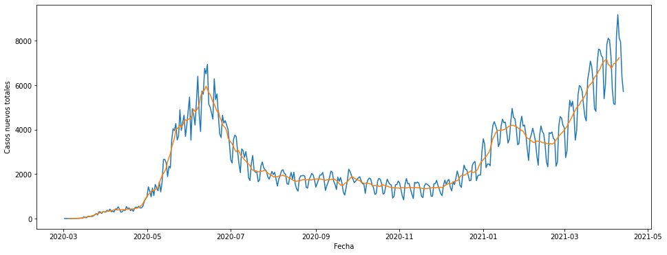

# Covid19 Chile Data Visualization 

This jupyter notebook shows how to visualize official data from the Ministerio de Ciencia about the development of the pandemic in Chile. This notebook uses the Pandas module to read and process the data. 

Data extracted from https://www.minciencia.gob.cl/COVID19. Notice that data is updated daily.
