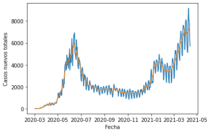

# Covid19 Chile Data Visualization 

This jupyter notebook shows how to plot up to date official data from the Ministerio de Ciencia of Chile about the pandemic's development. This notebook uses the Pandas module to read and process the data. 

Data extracted from https://www.minciencia.gob.cl/COVID19
